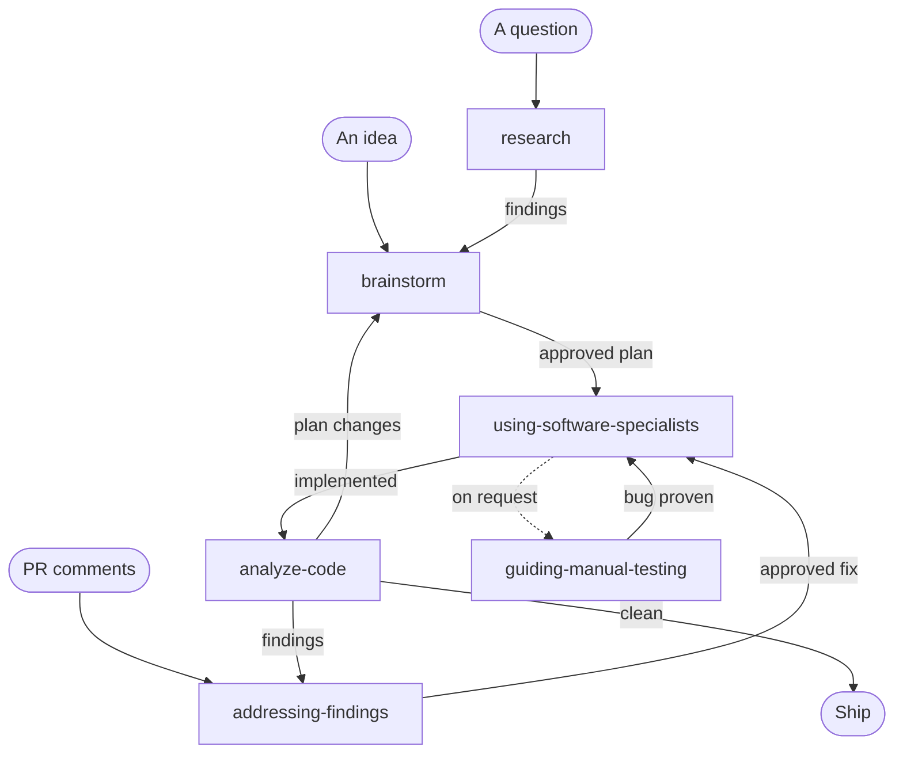

<div align="center">


**A coding agent with a workflow of its own.**

[](https://github.com/jjmrocha/joe/actions/workflows/ci.yml)
[](https://go.dev/dl/)
[](LICENSE)

[Why joe](#why-joe-the-workflow) · [What makes it practical](#what-makes-it-practical) · [Is joe for you?](#is-joe-for-you) · [Quickstart](#quickstart) · [Manual](docs/manual.md)

</div>

joe is one engineer's way of building software, turned into an agent. It doesn't adapt to
your workflow; it brings its own and follows it on every request. If that workflow fits
you, joe enforces it so you don't have to.

```
$ joe

❯ add a /version command that prints joe's version

  Route: a new capability (a new /version command) → Loading brainstorm

● skill_load(skill_name="brainstorm")
  ⎿ <6.5 KB> · 379ms

  Loading knowledge-base (kb_path configured)

● file_read(path="wiki/joe/index.md")
  ⎿ <10.5 KB> · 240ms

● serena__find_symbol(include_body=true, name_path_pattern="buildCommands", relative_path="internal/engine/commands.go")
  ⎿ <755 B> · 303ms

  ⋮ 10 more tool calls

  Findings from the repo and KB:

  • No version string exists anywhere in joe's code — no const, no ldflags, no debug.ReadBuildInfo use.
  • Slash commands are registered in internal/engine/commands.go (buildCommands, line 37) — the
    pattern in wiki/ai-chat/patterns/add-slash-command.

  The one real design decision is where the version value comes from:

  1. Hardcoded const — bumped by hand. Simple, drifts if forgotten. (my default)
  2. ldflags -X — set at build time. Accurate, but go run / go install print empty.
  3. runtime/debug.ReadBuildInfo — reports (devel) for local make build.

  Where should the version number come from?

──────────────────────────────────────────────────────────────────────────
 13 tool calls · 26s llm · 3s tools · ↑33.08K ↓616 tokens
```

---

## Why joe: the workflow

Every request is routed to a skill, a written procedure for that kind of work, and joe
says which one it loaded. Skills hand off to each other, so work moves through the same
loop every time:



| Skill | What joe does |
|---|---|
| `research` | Answers questions about your code by reading it, and cites the lines. Never from memory |
| `brainstorm` | Asks one question at a time and agrees a design with you before any code. The design becomes a saved plan; large work is split and built one part at a time |
| `using-software-specialists` | Builds the plan the way a team would: an architect's, security engineer's and tester's view where each applies, tests written first, every new interface checked for depth |
| `analyze-code` | Reviews the change from five angles, double-checks each finding, and reports. It never fixes |
| `addressing-findings` | Goes through the findings one at a time and recommends a fix for each. Nothing changes until you decide |
| `guiding-manual-testing` | Walks you through testing on a real environment, one step at a time: you run it, joe reads the result |

"Too small to need a skill" is never an excuse. A precise request still gets a short
design conversation: it confirms joe understood and surfaces what you didn't consider.

---

## What makes it practical

### A knowledge base of your organisation

One repository rarely tells the whole story. Point joe at a folder and ask it to ingest
each repository: it reads the code and writes a wiki of what it found (entities,
interfaces, events, jobs, dependencies, rules). Once every service is in, joe knows which
one owns a piece of data and who consumes an event before it changes anything. Plans from
`brainstorm` are saved there too, so work picks up where it left off. Code stays the
truth: a page that disagrees with the code is reported, not trusted.

### A second opinion from a different kind of model

The model writing your code doesn't grade its own work. At three critical calls joe asks a
classification model instead: one that writes no text, but answers a typed question
(yes/no, pick one, a score) with a calibrated probability. joe uses TypeSafe's
[Jev](https://openrouter.ai/blog/insights/what-is-jev/), the first model of this kind,
through OpenRouter. Its verdict is binding unless a named fact contradicts it.

- After a test goes green: does this function need more refactoring?
- In a review: how severe is each finding?
- Before a new interface is built: how deep is it?

The same model screens tool calls before they run: files change only in your repository and
knowledge base, nothing remote changes, no secret leaves the machine.

### Code by symbol, not by file

joe works through [Serena](https://github.com/oraios/serena), which uses language servers
to look up a function, its body or its references instead of reading whole files. Less
context spent, more precise edits, 40+ languages. Other repositories are read-only.

### Profiles for every situation

A profile is one JSON file holding the model, knowledge base, MCP servers and classifier.
Keep one per situation: `joe work` with the company knowledge base and a frontier model,
`joe local` on Ollama, with no cloud model. Bring OpenRouter, Anthropic or
Ollama, and switch models mid-session.

joe also reads the `CLAUDE.md` or `AGENTS.md` files you already keep, and saves and resumes
sessions.

---

## Is joe for you?

**Yes, if you:**

- want the design agreed before code is written;
- want to approve every change, one decision at a time;
- work across several services and want the agent to remember how they connect;
- prefer a fixed, predictable process to an endlessly configurable one.

**No, if you:**

- want an agent that adapts to your way of working;
- want a general-purpose assistant or a Claude Code replacement;
- want to vibe code the application;
- want quick edits without a conversation first.

---

## Quickstart

You need Go 1.27+, `git`, [uv](https://github.com/astral-sh/uv) (`uvx` on `PATH`) and an
API key, unless you use a local Ollama.

```bash
git clone https://github.com/jjmrocha/joe.git
cd joe
make build                              # writes ./bin/joe, that you copy to your PATH
```

The first run asks a few questions, writes your profile to `~/.config/joe/`, clones the
skills and opens the chat. Details in the [manual](docs/manual.md#install-and-first-run).

---

## Learn more

The [manual](docs/manual.md) covers everyday use, the workflow in depth, the knowledge
base, the guard, configuration and troubleshooting.

joe itself is small: the prompt, the configuration and the wiring. It's built on
[ai-toolkit](https://github.com/jjmrocha/ai-toolkit) (agent loop, LLM clients, tools),
[ai-chat](https://github.com/jjmrocha/ai-chat) (terminal UI, commands) and
[coding-skills](https://github.com/jjmrocha/coding-skills) (the skills).

---

Named after [Joe Armstrong](https://en.wikipedia.org/wiki/Joe_Armstrong_(programmer)),
creator of Erlang.

[MIT](LICENSE) © 2026 Joaquim Rocha
