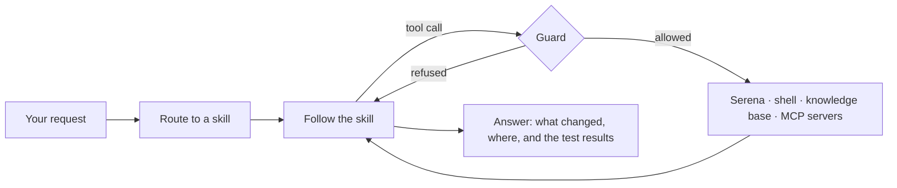

<div align="center">


**The opinionated coding agent for your terminal.**

[](https://github.com/jjmrocha/joe/actions/workflows/ci.yml)
[](https://go.dev/dl/)
[](LICENSE)

[Why joe](#why-joe) · [Quickstart](#quickstart) · [Everyday use](#everyday-use) · [Safety](#safety-model) · [Configure](#configure) · [Troubleshooting](#troubleshooting)

</div>

joe works in one repository at a time: it reads the code, changes it, runs the tests and
tells you what it did. It does not improvise. Every request goes through a written
procedure.

```
$ cd ~/sources/go/joe
$ joe

❯ what are the skills used on this project?

  Loading research

● skill_load(skill_name="research")
  ⎿ <3.0 KB> · 485ms

● serena__read_file(relative_path="internal/skills/skills.go")
  ⎿ <1.3 KB> · 377ms

  joe ships twelve skills, defined in  internal/skills/skills.go:14-27 :

  1. addressing-findings
  2. analyze-code
  3. brainstorm
  4. coding-discipline
  5. designing-interfaces
  6. guiding-manual-testing
  7. knowledge-base
  8. research
  9. style-checker
  10. test-driven-development
  11. using-software-specialists
  12. writing-unit-tests

  They're loaded from the coding-skills dir via  skills.Load()  ( internal/skills/skills.go:44 ). 
  The profile can add extra skills through  cfg.Skills  (loaded from  skills/  in the config folder), 
  but any name colliding with the twelve above is rejected with 
   ErrReservedSkill  ( internal/skills/skills.go:37-40 ) — these twelve are the prompt's routing table
  and are reserved.

───────────────────────────────────────────────────────────────────────────────────────────────────────────────────
 2 tool calls · 4s llm · 863ms tools · ↑19.02K ↓232 tokens

───── JOE ─────────────────────────────────────────────────────────────────────────────────────────────────────────

───────────────────────────────────────────────────────────────────────────────────────────────────────────────────
z-ai/glm-5.3-flash (openrouter) · max · ctx: 1% · tokens: 19.26K
```

Named after [Joe Armstrong](https://en.wikipedia.org/wiki/Joe_Armstrong_(programmer)),
creator of Erlang.

---

## Why joe

Every request is routed to a skill (a written procedure for that kind of work) before joe
touches anything. A bug gets the debugging procedure, a new feature starts by pinning down
requirements, a review follows the review checklist. The twelve skills live in [coding-skills](https://github.com/jjmrocha/coding-skills), cloned into
your config folder on first run.

joe reads code by symbol, through [Serena](https://github.com/oraios/serena): it looks up a
function, its body and its references instead of grepping and guessing, and edits at the
symbol level.

With a classifier configured, every tool call is checked against the session's rules
before it runs: files change only in the repository and the knowledge base, nothing remote
changes, no secret leaves the machine. See [Safety model](#safety-model).

Give joe a knowledge-base folder and it remembers across sessions. It keeps notes, plans
and manuals there, reads them before it starts and updates them after it finishes.

You bring the model: OpenRouter, Anthropic or a local Ollama, whichever your profile
names. Switch mid-session with `/model`.

### How a request flows



joe itself is small: the prompt, the configuration and the wiring.

| Built on | What it provides |
|---|---|
| [ai-toolkit](https://github.com/jjmrocha/ai-toolkit) | The agent loop, the LLM clients, the tool packs and the skill loader |
| [ai-chat](https://github.com/jjmrocha/ai-chat) | The chat core, the terminal UI and the slash commands |
| [coding-skills](https://github.com/jjmrocha/coding-skills) | The twelve skills joe loads by name |

---

## Quickstart

Three steps, about five minutes.

### 1. Prerequisites

| What | Why | How |
|---|---|---|
| Go 1.27+ | Building joe | [go.dev/dl](https://go.dev/dl/) |
| `git` | Finding the repository root, and cloning the skills on first run | Your package manager |
| `uvx` on `PATH` | Starts Serena, which serves joe's coding tools. **joe will not start without it** | [uv](https://github.com/astral-sh/uv) |
| An API key | Unless you run Ollama locally | [OpenRouter](https://openrouter.ai) or [Anthropic](https://console.anthropic.com) |

### 2. Build and export your key

```bash
git clone https://github.com/jjmrocha/joe.git && cd joe
make build                       # writes ./bin/joe

export OPEN_ROUTER_KEY=sk-...    # put this in your shell profile
```

Copy `./bin/joe` onto your `PATH` to run it as `joe` from anywhere. joe never stores the key:
the profile holds the *name* of the variable, and joe reads it at startup.

### 3. Run it

```bash
./bin/joe
```

The first run finds no profile, says where it will write one, and asks a few questions:

```
Provider [anthropic, ollama, openrouter]: openrouter
Model: z-ai/glm-5.3-flash
Name of the API key variable: OPEN_ROUTER_KEY
Harness [agents, claude]: claude

Knowledge base [yes, no]: yes
Knowledge base folder: /Users/you/Documents/LLM_WIKI

Classifier model [yes, no]: yes
Classifier model name: typesafe/jev-1.13
Name of the classifier API key variable: OPEN_ROUTER_KEY
```

Then it writes the profile, clones the skills, and opens the chat.

```
~/.config/joe/
├── default.json    your profile
├── AGENTS.md       empty, for harness: agents
├── coding-skills/  a git clone of coding-skills: joe's twelve skills
└── skills/         empty, for extra skills of your own
```

<details>
<summary>What each setup question decides</summary>

- `Provider`, `Model`, API key variable: the model joe talks to. The key question is
  skipped on Ollama.
- `Harness`: which instruction files joe reads; see
  [Your own instructions](#your-own-instructions). Pick `claude` if you already keep a
  `~/.claude/CLAUDE.md`.
- `Knowledge base`: whether joe gets the `file_*` tools; see
  [Knowledge base](#knowledge-base). joe does not create the folder: it must already
  exist, and joe asks again until it does. A leading `~` is expanded, and the profile stores
  the full path.
- `Classifier model`: whether joe screens tool calls and gets the `classify_*` tools;
  see [Safety model](#safety-model). It runs on OpenRouter, so the key is an OpenRouter one.

The folder and classifier questions only follow a `yes`. If the skills clone fails (no
network, say), joe stops with `clone skills: …` and keeps your answers: the next run clones
again without asking.

</details>

<details>
<summary>The twelve skills</summary>

`addressing-findings`, `analyze-code`, `brainstorm`, `coding-discipline`,
`designing-interfaces`, `guiding-manual-testing`, `knowledge-base`, `research`,
`style-checker`, `test-driven-development`, `using-software-specialists`,
`writing-unit-tests`.

Each loads from `~/.config/joe/coding-skills/<name>/SKILL.md`. joe never updates the clone
itself. To pick up upstream changes:

```bash
git -C ~/.config/joe/coding-skills pull
```

</details>

<details>
<summary>Optional: web search and library documentation</summary>

The default profile registers two MCP servers and starts neither: a server runs only when
it is listed in `mcps-on` or you start it with `/mcp on <name>`, so a missing one costs
nothing until you turn it on. `/mcp` lists them and their state.

- [DonSeTch](https://github.com/dondai44423/donsetch) does web search, page fetching and
  crawling. Without it joe works fine offline; a request that needs the web fails when the
  tool is called.
  ```bash
  npm install -g donsetch
  # or: brew tap dondai44423/donsetch && brew install donsetch
  ```
- [context7](https://github.com/upstash/context7) serves up-to-date documentation for
  libraries and frameworks. It runs through `npx`, so [Node.js](https://nodejs.org) is all it
  needs.

</details>

---

## Everyday use

Run joe from the repository you want it to work on. joe finds the git root and works there;
Serena starts with that project already active. Outside a repository, or with no `git`
installed, joe uses the current directory.

| Command | What it does |
|---|---|
| `/help` | List the commands |
| `/model [name]` | Show the current model, or switch to another from `llm.models` |
| `/effort [level]` | Show or change reasoning effort |
| `/clear` | Reset the conversation |
| `/compact` | Compact the context now, instead of waiting for joe to do it |
| `/export` | Save the session to `~/.config/joe/sessions/<id>.yaml`; exporting again updates that file, and `/clear` starts a new session with a new file |
| `/mcp [on\|off] [name]` | Show the MCP servers, or start and stop one |
| `/exit` | Quit |

To pick up an exported session later, start joe with `-resume` and the id from the file name.
The profile, when given, comes first:

```bash
joe -resume <id>          # same as: joe default -resume <id>
joe work -resume <id>
```

The model gets the whole conversation back and `/export` keeps writing to the same file. The
screen starts empty. joe resumes only from the repository the session was exported in, and
the profile decides the model and effort, not the file.

### Your own instructions

joe reads your standing instruction files at startup and quotes each into its prompt
verbatim, least specific first, skipping any that are absent. Which three depends on
`harness`:

| `harness` | Files, least specific first |
|---|---|
| `claude` | `~/.claude/CLAUDE.md`, `<repo>/CLAUDE.md`, `<repo>/CLAUDE.local.md` |
| `agents` | `~/.config/joe/AGENTS.md`, `<repo>/AGENTS.md`, `<repo>/AGENTS.local.md` |

A later file wins where two disagree. joe's own instructions win over all of them, on every
subject: your files can add to them or narrow them, not override or relax them.

Imports are not followed: a line like `@RTK.md` is passed through as text, and joe never
opens the file it names.

### Knowledge base

When the profile sets `kb-path`, joe gets seven more tools, confined to that folder and
unable to leave it: `file_read`, `file_write`, `file_edit`, `file_list`, `file_search`,
`file_delete`, `file_workdir`. The repository stays Serena's; the knowledge base is where
joe keeps notes, plans and manuals across sessions.

```json
{ "kb-path": "/Users/you/Documents/LLM_WIKI" }
```

Different profiles can name different folders, so `joe work` and `joe personal` keep
separate knowledge bases.

<details>
<summary>Rules for <code>kb-path</code></summary>

- The path must be absolute, and the folder must already exist: joe never creates it. A
  relative path stops joe at startup, with every other fault in the profile; a missing or
  unreadable folder stops it when the tools are registered.
- Omit the key and joe starts normally, without the `file_*` tools.
- The profile is the only place joe reads it from. A `kb_path` line in a `CLAUDE.md` or
  `AGENTS.md` is quoted into the prompt like any other line, and otherwise ignored: joe will
  not take a knowledge-base root from a file a repository can ship. The prompt's
  `<locations>` block names the path joe actually uses and tells the model to ignore any
  other, so a stale line cannot mislead it. If you used to keep the line in
  `~/.claude/CLAUDE.md`, move the value into your profile; leaving the line does no harm.

</details>

### Reading other repositories

A feature that spans repositories is still written in the one joe was started in. joe reads
the others through Serena's `query_project`, which refuses every editing tool.

<details>
<summary>Setting another repository up for reading</summary>

`query_project` only reaches repositories Serena has registered. Register each one once:

```bash
uvx --from git+https://github.com/oraios/serena serena project create /path/to/repo
```

Reading and searching files needs nothing more. Symbol lookups in another repository go
through Serena's project server, which joe does not start. Run it alongside joe if you want
them:

```bash
uvx --from git+https://github.com/oraios/serena serena start-project-server
```

Without it, joe falls back to searching the other repository as text.

</details>

---

## Safety model

joe's prompt states the session's rules. With a `classifier` in the profile, a separate
model also enforces them on every tool call:

- files are created, changed or deleted only inside the repository and the knowledge base;
- nothing remote or shared changes: no push, deploy, publish, merge or message;
- no secret or credential leaves the machine.

Before a tool call runs, joe sends the classification model the tool, its arguments and
those rules. A call judged to break them is refused, and the agent is told `rejected by joe`.
It stops and tells you what was refused rather than trying another route.

The guard fails open: if the classification model errors or takes longer than five
seconds, the call runs. It is a second line of defence, not a sandbox.

Some tools earn trust. The first call to each tool also asks whether *any* call to that
tool could break the rules. A tool judged unable to (`current_date`, say) is not checked
again until joe exits; `/clear` does not reset it. That verdict is read from the tool's own description, so
an MCP server can talk the model into trusting a tool it should not: **only add MCP servers
you trust.**

Without a classifier every call runs unchecked, and the `classify_*` tools are absent.

<details>
<summary>The classifier as a tool</summary>

The same model is offered to joe as `classify_yes_no`, `classify_choice` and
`classify_score`, so it can hand a judgement call to a calibrated model instead of guessing.
joe's instructions make three of those calls required, and each is billed: whether a
function needs more refactoring after a test goes green, the severity of each finding in a
code review, and how deep a new interface is before it is built.

</details>

---

## Configure

joe starts from a profile: a JSON file in `~/.config/joe/`, or in `$XDG_CONFIG_HOME/joe/`
when that variable is set. `joe` reads `default.json`; `joe <name>` reads `<name>.json`:

```bash
joe                  # ~/.config/joe/default.json
joe local            # ~/.config/joe/local.json (an Ollama profile, say)
joe local -resume <id>   # the same profile, resuming an exported session
```

Each profile is complete. joe runs exactly what the file says: a profile with no `mcps`
section gets no MCP servers. There is no merging between profiles and no hidden default.
Only `default.json` is written for you; create the others by hand or copy it. Keep
`default.json`. joe decides whether to run setup by looking for it, so deleting it makes
the next run ask the setup questions again.

```json
{
  "harness": "claude",
  "kb-path": "/Users/you/Documents/JOE_KB",
  "llm": {
    "provider": "openrouter",
    "api-key-env": "OPEN_ROUTER_KEY",
    "model": "z-ai/glm-5.3-flash",
    "models": [
      "z-ai/glm-5.3-flash",
      "z-ai/glm-5.3"
    ],
    "effort": "max"
  },
  "skills": [],
  "mcps": {
    "context7": {
      "command": "npx",
      "args": ["-y", "@upstash/context7-mcp"],
      "timeout": 60
    },
    "donsetch": {
      "command": "donsetch",
      "args": ["mcp", "--supervised"],
      "timeout": 900
    }
  },
  "mcps-on": [],
  "classifier": {
    "provider": "openrouter",
    "api-key-env": "OPEN_ROUTER_KEY",
    "model": "typesafe/jev-1.13"
  }
}
```

| Key | What it does |
|---|---|
| `harness` | `claude` or `agents`: which instruction files joe reads |
| `kb-path` | Absolute path to your knowledge base. Omit it for no knowledge base and no `file_*` tools |
| `llm.provider` | `openrouter`, `ollama` or `anthropic` |
| `llm.base-url` | Overrides the provider's endpoint; omit it for the standard one |
| `llm.api-key-env` | The **name** of the variable holding the key, never the key itself. Required except on Ollama |
| `llm.model` | The model joe starts with |
| `llm.models` | The models `/model` switches between |
| `llm.effort` | `off`, `low`, `medium` or `max`: how much the model reasons before answering |
| `skills` | Extra skills by name, loaded from `~/.config/joe/skills`. Cannot name one of joe's own twelve |
| `mcps` | MCP servers joe registers: `command`, `args`, `env` (variables inherited from joe), `timeout` in seconds (`0` or absent means 60) |
| `mcps-on` | The servers started at launch; start the rest with `/mcp on <name>` |
| `classifier` | The classification model behind the guard and the `classify_*` tools. Omit it for neither |
| `classifier.provider` | `openrouter` |
| `classifier.base-url` | Overrides the provider's endpoint; omit it for the standard one |
| `classifier.api-key-env` | The name of the variable holding the key. Required |
| `classifier.model` | The classification model, e.g. `typesafe/jev-1.13` |

joe validates the whole profile before the session opens and lists every fault at once:
an unknown provider, effort, harness or `mcps-on` server; a skill that is not a bare name or
is one of joe's own twelve; a `kb-path` that is not absolute; an empty model; an API-key
variable that is not set.

Serena is not configurable: it always starts with joe.

---

## Troubleshooting

| Message | Cause | Fix |
|---|---|---|
| `skill folder not found: …` | One of the twelve is missing from `~/.config/joe/coding-skills`, or an extra from `~/.config/joe/skills` | After upgrading joe, run `git -C ~/.config/joe/coding-skills pull`: a newer joe can need a skill your clone predates. Otherwise restore it, or delete `coding-skills/` and joe clones it again. Every missing one is listed at once |
| `clone skills: …` | The first-run clone of coding-skills failed; git's own message is printed above it | Check the network and `git`, then run joe again. Only the clone is retried |
| `skill is one of joe's own` | The profile's `skills` names one of the twelve | Remove it from `skills` |
| `api key variable is not set` | `api-key-env` names a variable with no value | `export` it, or point `api-key-env` at the one you use |
| `classifier provider is not openrouter` | `classifier.provider` is anything else | Use `openrouter` |
| `profile not found` | `joe <name>` with no `<name>.json` | Create the file; only `default.json` is written for you |
| `no answer to read` | Setup ran with nothing on stdin: a pipe, a redirect, or Ctrl-D at a question | Run joe from a terminal; nothing is left broken, the next run asks again |
| `kb-path is not absolute` | `kb-path` is relative or starts with `~` | Spell the path out in full |
| `opening root: …` | `kb-path` names a folder that is missing or unreadable | Create it, or drop the key |
| `harness is not claude or agents` | Unknown `harness` value | Use `claude` or `agents` |
| `git rev-parse: …` | `git` is present but refusing (dubious ownership, unreadable `.git`) | Fix the repository, or run joe somewhere else |
| `coding tools: …` | Serena failed to start, usually because `uvx` is not on `PATH` | Install [uv](https://github.com/astral-sh/uv) and check `uvx` runs |

- An `mcps-on` server that fails to start does not stop joe. The failure prints before
  the chat opens, `/mcp` shows the server as `off`, and `/mcp on <name>` retries it.
- To start over, delete `~/.config/joe` (or just its `default.json`) and run joe
  again. An interrupted setup is finished by the next run, and nothing already in the folder
  is ever overwritten: an existing `default.json` means setup does not run, and an
  `AGENTS.md` you have edited is left as it is.

---

## Development

`make` on its own lists every target:

| Target | Effect |
|---|---|
| `build` | Build joe into `./bin` |
| `clean` | Remove `./bin` |
| `test` | Run all tests with the race detector |
| `bench` | Run benchmarks |
| `lint` | Run golangci-lint |
| `deps` | Update dependencies |
| `tidy` | Tidy `go.mod` |

CI runs `go test -race ./...`, `golangci-lint`, `govulncheck` and a gitleaks secret scan on
every push and pull request ([`.github/workflows/ci.yml`](.github/workflows/ci.yml)).
golangci-lint must be v2.13.2 or newer; earlier releases are built with an older Go and
refuse this module.

## License

[MIT](LICENSE) © 2026 Joaquim Rocha
